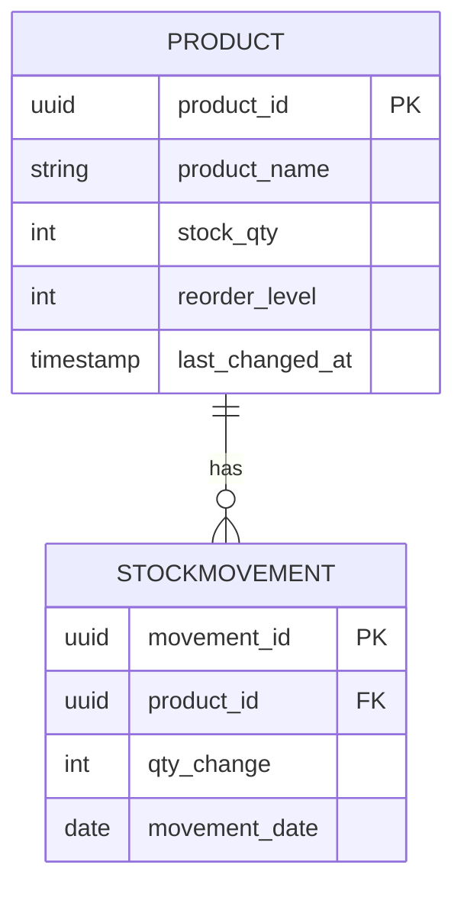
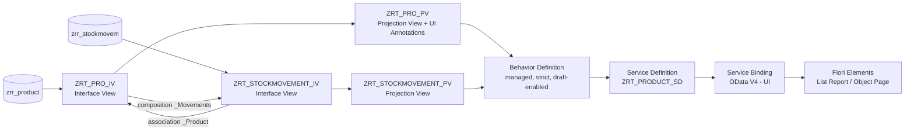

# Project 1 — RAP Product & Stock Movement Service (OData V4)

## Problem Statement
Warehouse/retail teams need a simple way to track product master data
alongside every stock adjustment (inbound, outbound, corrections) without
losing an audit trail of who changed what and when. This project builds a
**draft-enabled, CRUD-Q RAP business service** on SAP BTP ABAP Environment
that manages `Product` records and their associated `Stock Movements`,
exposes them as an OData V4 service, and auto-generates a Fiori Elements
UI on top — with a custom `reorderNow` action and server-side stock
validation baked into the business layer.

## Architecture

**RAP layer stack**

## Tech Stack
- **SAP BTP ABAP Environment** (Steampunk) — RAP (RESTful ABAP Programming Model)
- **CDS Views** — interface + projection layers with `@UI` annotations
- **Behavior Definitions/Implementations** — managed, draft-enabled
- **OData V4** service binding, tested via **Swagger UI** and Postman
- **SAP Fiori Elements** — auto-generated List Report / Object Page

## What Was Built
| Layer | Object | Purpose |
|---|---|---|
| Database Table | `zrr_product` | Product master (`product_id`, `product_name`, `stock_qty`, `reorder_level`, `last_changed_at`) |
| Database Table | `zrr_stockmovem` | Stock movement log (`movement_id`, `product_id`, `qty_change`, `movement_date`) |
| Interface View | `ZRT_PRO_IV` | Root view, composition to `_Movements` |
| Interface View | `ZRT_STOCKMOVEMENT_IV` | Child view, association to parent `_Product` |
| Projection View | `ZRT_PRO_PV` | UI-annotated projection (`@UI.lineItem`, `@UI.identification`, `@UI.selectionField`, `@UI.facet`) |
| Projection View | `ZRT_STOCKMOVEMENT_PV` | Redirected composition child projection |
| Behavior Definition | `ZRT_PRO_PV` (managed, strict(2), draft) | create/update/delete, validation, determination, custom action |
| Service Definition | `ZRT_PRODUCT_SD` | Exposes `Product { _Movements }` |
| Service Binding | `ZRT_PRO_IV_SB` (OData V4 - UI) | Published service + Fiori App URL |

### Business Logic
- **Validation** `validateStock` — runs on save, prevents negative stock quantities.
- **Determination** `setLastChanged` — auto-stamps `last_changed_at` on create/update.
- **Custom Action** `reorderNow` — bumps stock by a fixed reorder quantity via a single call.
- **Draft handling** — `with draft`, `use action Edit/Resume/Activate/Discard/Prepare` — every create/edit goes through a draft before activation, matching standard Fiori Elements UX.

## Screenshots

| | |
|---|---|
|  | Database tables `ZRR_PRODUCT` and `ZRR_STOCKMOVEM` with key fields |
|  | `ZRT_STOCKMOVEMENT_IV` and `ZRT_PRO_IV` — composition + association |
|  | `ZRT_PRO_PV` — `@UI.headerInfo`, `@UI.facet`, `@UI.lineItem`, `@UI.selectionField` |
|  | `ZRT_PRO_PV`/`ZRT_STOCKMOVEMENT_PV` — validations, determinations, `reorderNow` action, draft actions |
|  | `ZRT_PRO_IV_SB` — OData V4-UI binding, `Product`/`Movement` entity sets, Fiori App URL |
|  | Auto-generated Swagger UI — `GET /Product`, `GET /Product/{product_id}`, `POST /$batch` |
|  | Live Fiori Elements list report: Products with `stock_qty`, `reorder_level` |
|  | Associated Stock Movements list, driven by the `_Movements` composition |
|  | Create → draft (Create/Discard Draft) → **Object created** toast |
|  | Multi-select delete → **Objects deleted** toast |

> Save your screenshots into `docs/images/` with these exact names (or update
> the paths above) — see the "Presenting this on GitHub" notes below for why.

## API Contract

| Operation | Method | Endpoint | Notes |
|---|---|---|---|
| List products | `GET` | `/Product` | Returns all products |
| Read one product | `GET` | `/Product('<uuid>')` | By key |
| Create product | `POST` | `/Product` | Creates a draft first (draft-enabled) |
| Update product | `PATCH` | `/Product('<uuid>')` | `product_id` and `last_changed_at` are read-only |
| Delete product | `DELETE` | `/Product('<uuid>')` | |
| Reorder stock | `POST` | `/Product('<uuid>')/reorderNow` | Custom RAP action, bumps `stock_qty` |
| List stock movements | `GET` | `/Movement` | Or via `/Product('<uuid>')/_Movements` |
| Batch requests | `POST` | `/$batch` | Groups multiple operations in one call |

## What I'd Do Differently at Scale
- Move `validateStock` and `setLastChanged` logic into a shared, reusable
  class rather than embedding it directly in the behavior implementation,
  so the same rules can be applied across multiple behavior definitions.
- Add authorization checks at the instance level (currently
  `#NOT_REQUIRED` on the interface views) before this goes anywhere near
  production.
- Introduce numbering/ID generation via a proper number range object
  instead of relying solely on managed UUID keys, if this needs to
  integrate with external systems that expect sequential IDs.
